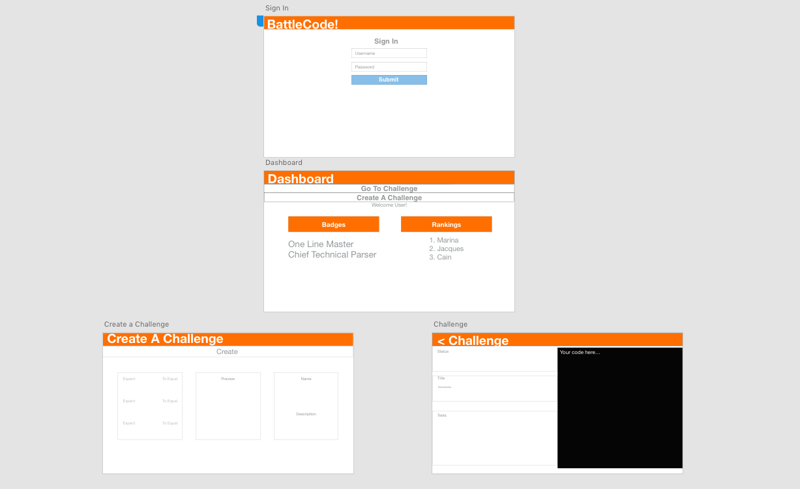
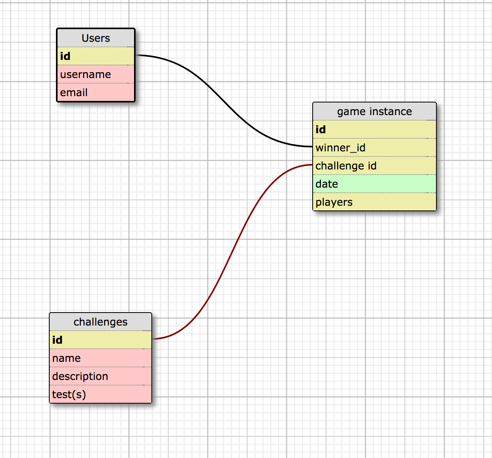
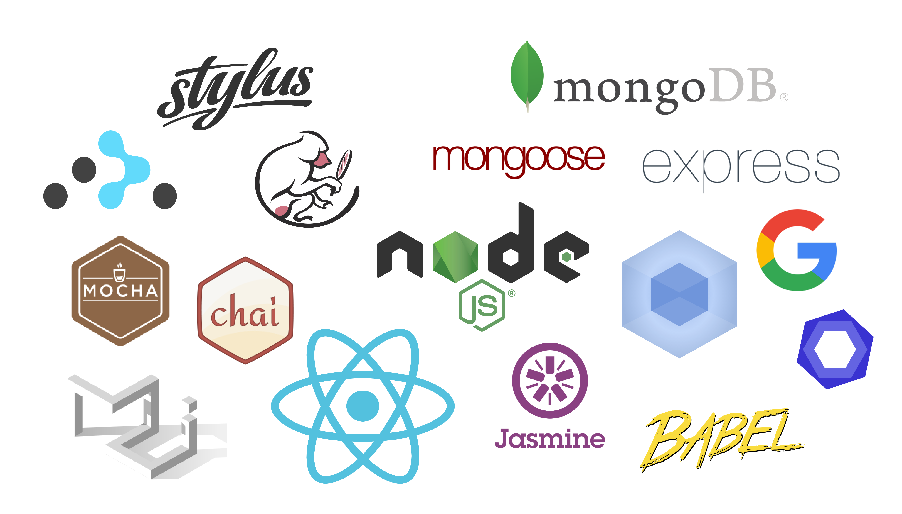

# BattleCode

Test your coding skillz against anyone. Then create new challenges for others to test themselves against!

## Team

  - __Product Owner__: Marina Mcgrath (Middleend)
  - __Scrum Master__: Cain Watson (Frontend)
  - __Lead Engineer__: Jacques Metevier (Backend)

## Table of Contents

1. [How it works](#how-it-works)
2. [App Wireframe](#wireframe)
3. [Architecture](#architecture)
4. [Database](#database)
5. [Tech Stack](#tech-stack)
6. [Development](#development)
  6. [System Requirements](#system-requirements)
  6. [Installation](#installation)

## <a name="how-it-works"></a>How it Works

> Bringing fast paced fun to coding.
BattleCodes lets you solve programming challenges in a race against friends. The first to write code that passes all of the tests wins! Earn badges for special achievements like the Ali One Liner Badge!

## <a name="wireframe"></a>App Wireframe


## <a name="live-app-wireframe"></a>Live App Wireframe


## <a name="Database"></a>Database


## <a name="tech-stack"></a>Tech Stack


## <a name="development"></a>Development
Setting up a development environment requires global installations of node


### <a name="system-requirements"></a>1. System Requirements

* Globally installed [node](https://nodejs.org/en/) >= 4.0

## <a name="installation"></a>2. Installation

On the command prompt run the following commands

```sh
$ git clone https://github.com/Javacrypts/BattleCode.git

$ cd BattleCode/

$ npm run setup
```


**For Database:**

BattleCode uses MongoDB through Mongoose. Setup a local instance of a MongoDB or use Mlabs and reconfigure dbTools.js to connect to it.

## <a name="contributing"></a>4. Contributing
